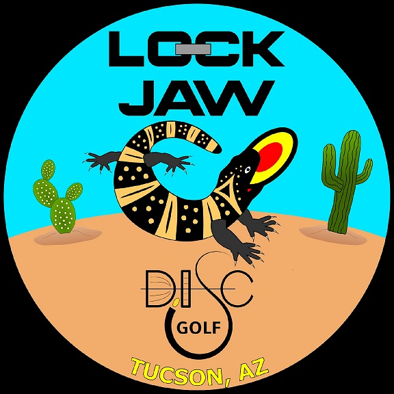

# Putting Improver - Complete Solution

A comprehensive disc golf putting practice tracker with web and mobile applications, built for Lock Jaw Disc Golf in Tucson, AZ.



## 📦 What's Included

This repository contains:
- ✅ **Web Application** - Full-featured web app with Firebase integration
- ✅ **Mobile Application** - React Native app for iOS and Android
- ✅ **Firebase Configuration** - Complete Firebase setup with Firestore and Authentication
- ✅ **CI/CD Pipeline** - GitHub Actions for automated deployment
- ✅ **Complete Documentation** - Setup guides, troubleshooting, and API documentation

## 🚀 Features

### Core Features
- 📊 **Practice Session Tracking** - Log putting practice with distance, makes, and attempts
- 🏆 **Community Leaderboard** - Compete with other players and track your ranking
- 👥 **Friends System** - Add friends and compare progress
- ⚡ **Weekly Challenges** - Complete challenges to earn bonus points
- 🏅 **Achievement System** - Unlock 10+ achievements as you improve
- 📈 **Statistics Dashboard** - Track total putts, accuracy, streaks, and points
- 💾 **Cloud Sync** - Data syncs across all devices via Firebase Firestore
- 🔐 **Secure Authentication** - Google, Apple, Email, and Anonymous authentication

### Mobile Features
- 📱 Native iOS and Android apps
- 🔔 Push notifications for challenges and achievements
- 📍 GPS integration for location-based features
- 📸 Camera integration for profile pictures
- 🌙 Dark mode support
- ⚡ Offline mode with sync when online

## 🏗️ Tech Stack

### Web Application
- **Frontend**: Vanilla JavaScript (ES6 Modules), HTML5, CSS3
- **Architecture**: Modular design with separated concerns
- **Authentication**: Firebase Authentication
- **Database**: Firebase Firestore
- **Hosting**: Firebase Hosting
- **Design**: Custom CSS with Lock Jaw branding

### Mobile Application
- **Framework**: React Native
- **State Management**: React Context API + AsyncStorage
- **Navigation**: React Navigation 6
- **Authentication**: Firebase Authentication
- **Database**: Firebase Firestore
- **Push Notifications**: Firebase Cloud Messaging
- **Platforms**: iOS 13+ and Android 8+

## 📁 Project Structure

```
putting-improver-complete/
├── web/                    # Web application
│   ├── css/               # Stylesheets
│   ├── js/                # JavaScript modules
│   │   ├── config/        # Configuration
│   │   ├── modules/       # Core modules
│   │   └── utils/         # Utility functions
│   ├── assets/            # Images and assets
│   ├── index.html         # Main HTML file
│   ├── firebase.json      # Firebase config
│   ├── firestore.rules    # Firestore security rules
│   └── package.json       # Dependencies
├── mobile/                # React Native mobile app
│   ├── src/               # Source code
│   │   ├── components/    # Reusable components
│   │   ├── screens/       # App screens
│   │   ├── navigation/    # Navigation setup
│   │   ├── services/      # API and Firebase services
│   │   ├── utils/         # Utility functions
│   │   └── config/        # App configuration
│   ├── ios/               # iOS native code
│   ├── android/           # Android native code
│   ├── app.json           # Expo/RN config
│   └── package.json       # Dependencies
├── docs/                  # Documentation
│   ├── SETUP.md           # Setup guide
│   ├── API.md             # API documentation
│   ├── DEPLOYMENT.md      # Deployment guide
│   └── TROUBLESHOOTING.md # Common issues
├── .github/               # GitHub configuration
│   └── workflows/         # CI/CD pipelines
└── README.md              # This file
```

## 🚀 Quick Start

### Prerequisites
- Node.js 18+ and npm
- Firebase CLI (`npm install -g firebase-tools`)
- Git
- For mobile: React Native CLI, Xcode (iOS), Android Studio (Android)

### Web Application Setup

1. **Clone and navigate to web directory**
```bash
cd putting-improver-complete/web
npm install
```

2. **Configure Firebase**
```bash
# Login to Firebase
firebase login

# Initialize your project (or use existing)
firebase init
```

3. **Update Firebase configuration**
Edit `js/config/firebase.js` with your Firebase project credentials.

4. **Start development server**
```bash
npm start
```

5. **Deploy to Firebase**
```bash
npm run deploy
```

### Mobile Application Setup

1. **Navigate to mobile directory**
```bash
cd putting-improver-complete/mobile
npm install
```

2. **Install iOS dependencies** (macOS only)
```bash
cd ios && pod install && cd ..
```

3. **Configure Firebase**
- Add `google-services.json` to `android/app/`
- Add `GoogleService-Info.plist` to `ios/`

4. **Run on device/simulator**
```bash
# iOS
npm run ios

# Android
npm run android
```

## 🔧 Configuration

### Firebase Setup

1. **Create Firebase Project**
   - Go to [Firebase Console](https://console.firebase.google.com)
   - Click "Add project"
   - Follow the setup wizard

2. **Enable Services**
   - **Authentication**: Google, Apple, Email, Anonymous
   - **Firestore Database**: Start in production mode
   - **Hosting**: Enable for web deployment
   - **Cloud Functions**: For backend logic (optional)

3. **Add Apps**
   - Add Web app for web application
   - Add iOS app for mobile (iOS)
   - Add Android app for mobile (Android)

4. **Update Configuration Files**
   - Web: `web/js/config/firebase.js`
   - Mobile: `mobile/src/config/firebase.js`

See [docs/SETUP.md](docs/SETUP.md) for detailed instructions.

## 📱 Mobile App Store Deployment

### iOS (TestFlight/App Store)
```bash
cd mobile/ios
fastlane beta  # TestFlight
fastlane release  # App Store
```

### Android (Play Store)
```bash
cd mobile/android
./gradlew bundleRelease
```

See [docs/DEPLOYMENT.md](docs/DEPLOYMENT.md) for complete deployment instructions.

## 🎨 Customization

### Branding
The app uses Lock Jaw Disc Golf's color palette:
- Primary: Coral-Red Gradient (#FF6B35 to #D9534F)
- Secondary: Cyan (#00CED1 to #20B2AA)
- Accent: Desert Tan (#F4A460 to #D2691E)
- Background: Sandy Beige (#FFE4B5 to #D2B48C)

To customize:
- Web: Edit `web/css/styles.css`
- Mobile: Edit `mobile/src/styles/theme.js`

### Logo
Replace `logo.jpg` in:
- Web: `web/logo.jpg`
- Mobile: `mobile/src/assets/logo.png`

## 📊 Point System

Points are calculated based on:
- **Distance**: Longer putts earn more points (distance multiplier)
- **Accuracy**: Higher accuracy percentage increases points
- **Volume**: More makes = more points

**Formula**: `Points = Makes × (Distance/10) × (Accuracy%/100) × 10`

## 🏆 Achievements

- 🎯 **First Steps** - Complete your first practice session
- 💯 **Perfect 10** - Make 10 putts in a row at 100%
- 💪 **Century Club** - Score 100+ points in one session
- 🔥 **Week Warrior** - Practice 7 days in a row
- 👑 **Month Master** - Practice 30 days in a row
- 🚀 **Distance Demon** - Make 5+ putts from 40+ feet
- 🦋 **Social Butterfly** - Add 5 friends
- ⭐ **Point King** - Earn 1000+ total points
- 🥇 **Podium Finish** - Reach top 3 on leaderboard
- ✅ **Challenge Accepted** - Complete a weekly challenge

## 🧪 Testing

### Web
```bash
cd web
npm test
```

### Mobile
```bash
cd mobile
npm test
```

## 🤝 Contributing

Contributions are welcome! Please read [CONTRIBUTING.md](CONTRIBUTING.md) for guidelines.

1. Fork the repository
2. Create your feature branch (`git checkout -b feature/AmazingFeature`)
3. Commit your changes (`git commit -m 'Add some AmazingFeature'`)
4. Push to the branch (`git push origin feature/AmazingFeature`)
5. Open a Pull Request

## 📝 License

This project is licensed under the MIT License - see [LICENSE](LICENSE) file for details.

## 📞 Support

- **Documentation**: [docs/](docs/)
- **Issues**: [GitHub Issues](https://github.com/yourusername/putting-improver/issues)
- **Email**: support@lockjawdiscgolf.com

## 🙏 Acknowledgments

- Lock Jaw Disc Golf for branding and support
- Firebase for backend infrastructure
- React Native community
- All contributors

## 🗺️ Roadmap

- [ ] Tournament mode
- [ ] Video recording and analysis
- [ ] AI-powered putting tips
- [ ] Apple Watch integration
- [ ] Advanced analytics dashboard
- [ ] Social media sharing
- [ ] Multi-language support

---

**Made with 🥏 in Tucson, AZ**

**Version**: 2.0.0  
**Last Updated**: December 2024
